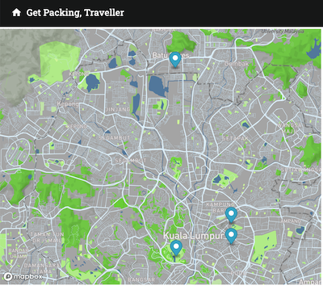

# Welcome
This repository contains the source code for the AI powered travel 
planner, **Get Packing Traveller**

Link: https://main.d2azdyrrhon0fz.amplifyapp.com/
# Contents
- [Required Tech](#required-tech)
- [How to Run the App](#how-to-run-the-app)
- [How To Contribute](#how-to-contribute)
  - [Pull Request (PR) Strategy](#pull-request-pr-strategy)
- [Additional Notes](#additional-notes)
  - [Tech Stack](#tech-stack)
  - [APIs Used](#apis-used)
  - [Common Issues](#common-issues)
  - [GitHub Actions](#github-actions)
  - [Software Versions](#software-versions)
  - [License Information](#license-information)
# Required Tech
- A computer (Windows or Mac is fine)
- node.js installed on your machine
- an IDE or text editor (ideally vs code)
- [OPTIONAL] Docker
# How to Run the App 

Check out [this document](other-readmes/RUNNING_APP.md) for an in depth guide on how to install dependencies, adding environment variables and running the application in the dev and prod environments. 

# How to Contribute
## Setting up your Devolpment Environment
### Clone Git Repository
Clone the git repository:`git clone https://github.com/Monash-FIT3170/AI_Travel_Plan`

### Setting up Environment Variables And Client and Server Dependencies
Check out [this document](other-readmes/RUNNING_APP.md) for an in depth guide on how to install dependencies, adding environment variables and running the application in the dev and prod environments. 

## Coding Standards and Best Practices
We use React Bootstrap for UI components.

(Recommended) Install the ES7+ React/Redux/React-Native snippets extension for VS Code to enhance your development workflow.

## Directory Structure and Where to Add New Files
- React Components: Add new React components inside the src/components directory.

- Server Routes: New server routes should be added inside the server/routes directory.

- Features: Any new feature modules should be added inside the src/features directory.

## Contributing New Features or Changes
1)Always pull the latest changes from the main branch before starting your work: `git pull origin main`

2)Create a new branch for your feature or change: `git checkout -b feature/your-feature-name`

3)After completing your work, push your changes to the repository: `git push origin feature/your-feature-name`

4)reate a pull request (PR) from your branch to the main branch. Ensure to add relevant reviewers for your PR.

5)After your PR is reviewed and approved, it will be merged into the main branch.

## Troubleshooting Guide
Encountering issues while setting up or developing the project is not uncommon. Below are some common problems and their respective solutions to help you get past them quickly.

1. NPM Install Fails

Problem: If you encounter errors while running npm install.

Solution:

- Ensure you have the correct version of Node.js and npm installed. You can check your version by running `node -v` and `npm -v`.

- Delete the node_modules/ folder and package-lock.json file in both client and server directories, then run `npm install` again.

2. Docker Containers Not Starting

Problem: Docker containers fail to start when running `docker-compose up`.

Solution:
- Ensure Docker is running. You can check if Docker is running by executing docker info.

- Check the logs by running docker-compose logs to identify the specific issue.

- Ensure all required environment variables and configurations are properly set.

3. API Keys Not Working

Problem: The application is not connecting to external services.

Solution:

- Ensure the `.env` file is correctly placed in the server directory and has the right keys and values.

- Restart the server after adding or modifying the `.env` file to ensure the changes take effect.

4. Changes Not Reflecting

Problem: Code changes are not reflecting in the application.

Solution:

- Ensure the application is being recompiled and reloaded after making changes. In the case of Docker, rebuild the containers using `docker-compose up --build`.

- Clear the browser cache or try another browser to ensure the changes are not being masked by cached data.

## Pull Request (PR) Strategy

### What type of PR is this? (check all applicable)

- [ ] Refactor
- [ ] Feature
- [ ] Bug Fix
- [ ] Optimisation
- [ ] Documentation Update

Definitions: 
- Refactor: Improving the code quality, readabililty, or maintainablity of existing code.
- Feature: Adding a new feature or capabilities to the project.
- Bug Fix: Fixing a bug or resolving an issue.
- Optimisation: Improving code or system performance and efficiency.
- Documentation Update: Enhance project documentation to ensure accuracy and usability.
### Description
Briefly describe the purpose and scope of your pull request.

e.g.
This PR resolves the issue where the locations weren't loading on the map on the itinerary page.

## Related Tickets & Documents
If your pull request is related to an issue or document, you can link them by using the following keywords:

e.g. Related Issue #99

- Closes #99
- Fixes #99
- Resolves #99

_Any of these three keywords (closes, fixes, resolves) will link the pull request 
to the issue and indicate that the issue will automically be closed when the pull request is merged._

### QA Instructions, Screenshots, Recordings

_Please replace this line with instructions on how to test your changes, a note
on the devices and browsers this has been tested on, as well as any relevant
images and/or recording(s) for UI changes._

e.g.

Testing Instructions:
- Generate an itinerary on the Travel Planner page.
- Verify that the markers load correctly on the map on the Itinerary page.
- Check for any error messages or unexpected behaviour when loading the itinerary page.

Devices/Browsers Tested On:
- Devices: MacBook Pro, Desktop
- Browsers: Google Chrome, Mozilla Firefox

Screenshots for UI Changes:

Before:

After:

### UI accessibility checklist

_If your PR includes UI changes, please utilise this checklist:_

- [ ] Semantic HTML implemented?
- [ ] Keyboard operability supported?
- [ ] Checked with [axe DevTools](https://www.deque.com/axe/) and addressed `Critical` and `Serious` issues?
- [ ] Color contrast tested?

_For more info, check out the
[Forem Accessibility Docs](https://developers.forem.com/frontend/accessibility)._

### Added/updated tests?

_We encourage you to keep the code coverage percentage at 80% and above._

- [ ] Yes
- [ ] No, and this is why: _please replace this line with details on why tests
      have not been included_
- [ ] I need help with writing tests

# Additional Notes 
This section will outline our tech stack, APIs used, and some common troubleshooting. 
## Tech Stack 
- Front end components are created in the `src/components` folder and use [React jsx](https://legacy.reactjs.org/docs/introducing-jsx.html) syntax. 
	> Currently, we make use of [React Material UI](https://mui.com/material-ui/getting-started/) library for our components
 - Front End pages are stored in `src/pages` folder.
- Back end code is written in the `server` directory in the [TypeScript](https://www.typescriptlang.org/) language.
- Swagger documentation for backend routes uses OpenAPI syntax. See example [here](other-readmes/EXAMPLE_SWAGGER_DOC.md):

- Front and back-end communication is handled by [Express.js](https://expressjs.com/)
  	>To add more routes, create router function on the routes folder. From the server.ts file create a link to the route functions
  
## APIs Used
In the front end: 
- [React Map GL](https://visgl.github.io/react-map-gl/)
	> Since this UI library is built on [Mapbox](https://www.mapbox.com/), you should obtain an API key from their site. The [free tier](https://www.mapbox.com/pricing) should be more than enough
- [Open Weather](https://openweathermap.org/api)
- [Google Places API](https://developers.google.com/maps/documentation/places/web-service/overview)

In the back end: 
- [OpenAI API Doc](https://openai.com/blog/openai-api)
- [Emergency Contact Doc](https://emergencynumberapi.com/)
- [Currency Exchange API Doc](https://github.com/fawazahmed0/currency-api)
- [country code coversion API Doc](https://restcountries.com/)

## Common Issues
When running code someone else has written, ensure you perform `npm install` commands to install any new dependencies they may have added.

If there are issues where old itinerary information is being displayed, or the app crashes with an index error, open local storage and clear all itinerary and chat data.

Ensure you are adding all API keys to the relevant `.env` files.

The current frontend loading is quite slow, improvements are necessary

## GitHub Actions
GitHub Actions is the (CI/CD) platform used to automate our build, test, and deployment pipeline. More information can be found [here](other-readmes/GITHUB_ACTIONS_INFO.md)

## Software Versions
Please visit [this page](other-readmes/SOFTWARE_VERSIONS.md) for a list of both front and backend dependencies and their versions allowing for a stable release of the application.

## Versioning Strategy
Our project adheres to the principles of semantic versioning (SemVer) to manage version updates. SemVer employs three components: MAJOR, MINOR, and PATCH, each signifying a specific category of change:

- MAJOR version increments indicate significant, potentially incompatible changes or major feature additions that may necessitate code adjustments on the user's part.
- MINOR version increases represent backward-compatible feature enhancements and additions.
- PATCH version updates cover backward-compatible bug fixes or minor improvements.

Our version numbers follow the format MAJOR.MINOR.PATCH (e.g., 1.0.0). 

Please update the project's version by changing the relevant `package.json` files.

## License Information
This project is licensed under the MIT License - see the [LICENSE](LICENSE) file for details.
